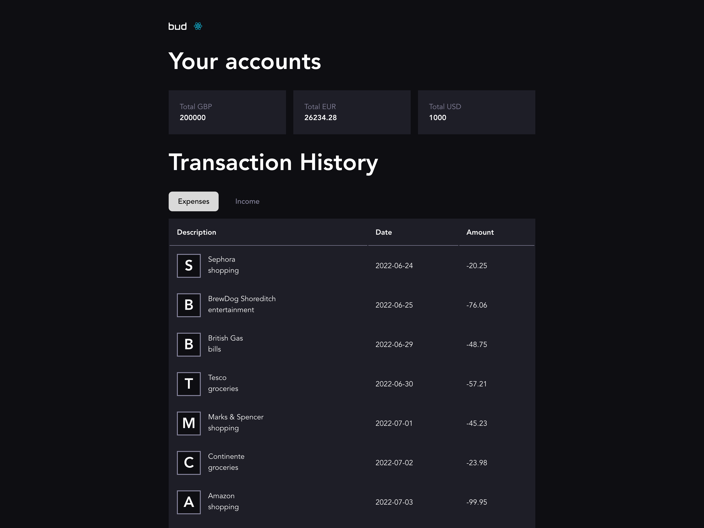

# Connecting to the API

Once you're all up and running, before any changes have been made - the site should look as follows:

You've got complete free-reign for this exercise, please work with whatever tools you feel most comfortable with - however, we may ask you to think about how you'd solve these tasks with 'vanilla' TypeScript.

Currently, the data in the UI is coming from two hardcoded sources ([accounts](/src/api/data/accounts.ts) and [transactions](/src/api/data/transactions.ts)).

We have a fake api setup with [MSW](https://mswjs.io/). It has `/api/accounts` and `/api/transactions` routes.

We'd like you to replace the hardcoded data with api calls to those routes.

---

**Why are we asking you to do this?**

- We want to see that you can get setup on an unfamiliar project.
- We want to see that you can work with APIs and React.
